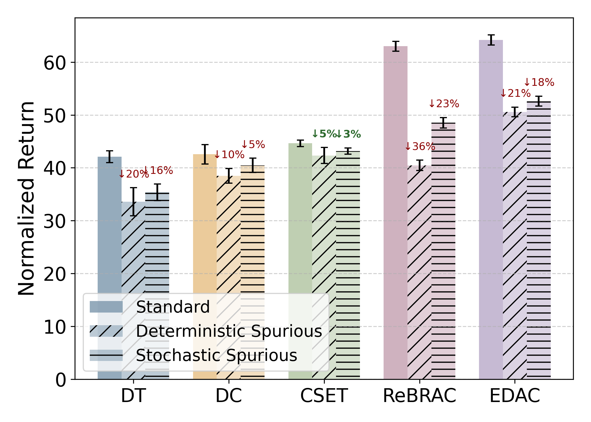
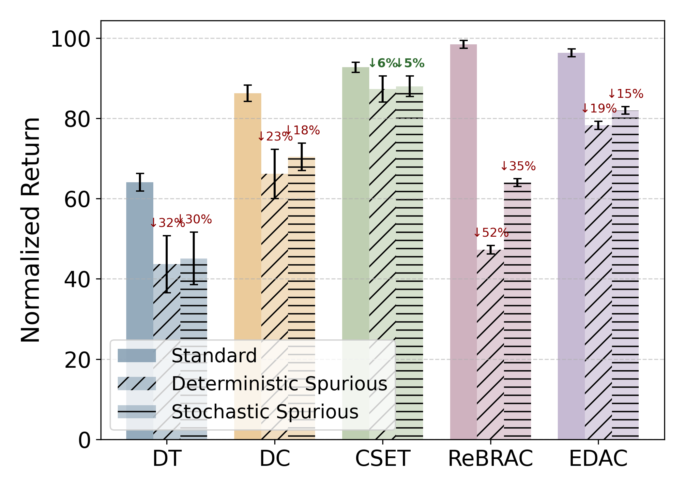
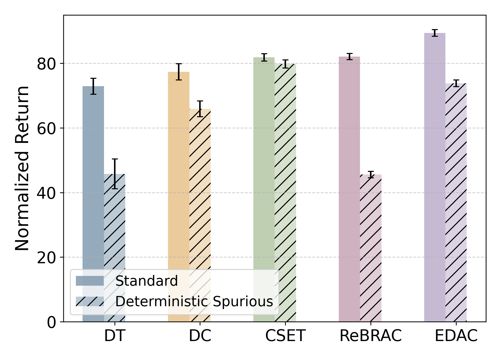
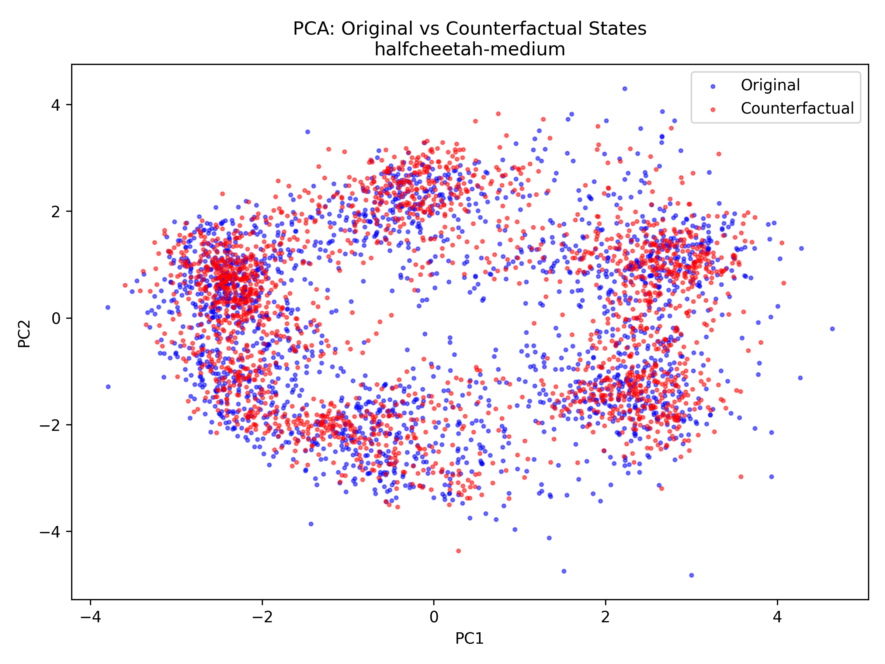
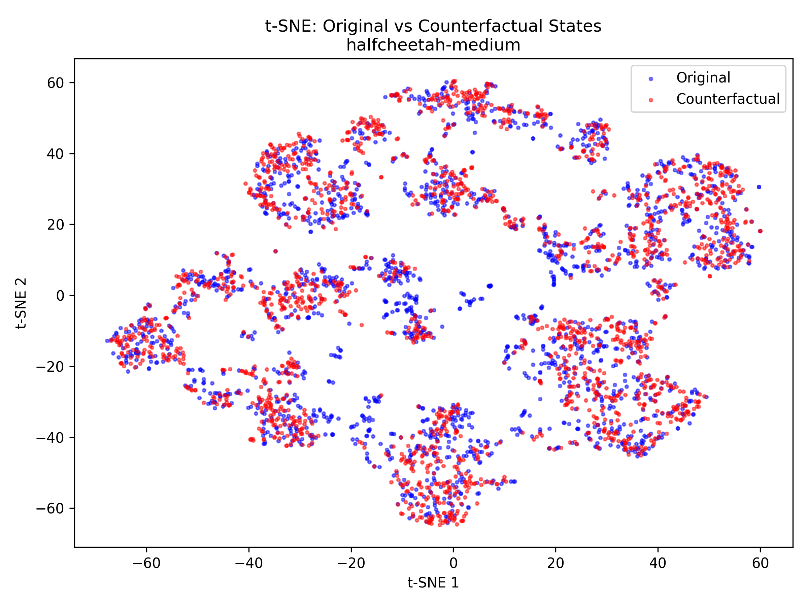
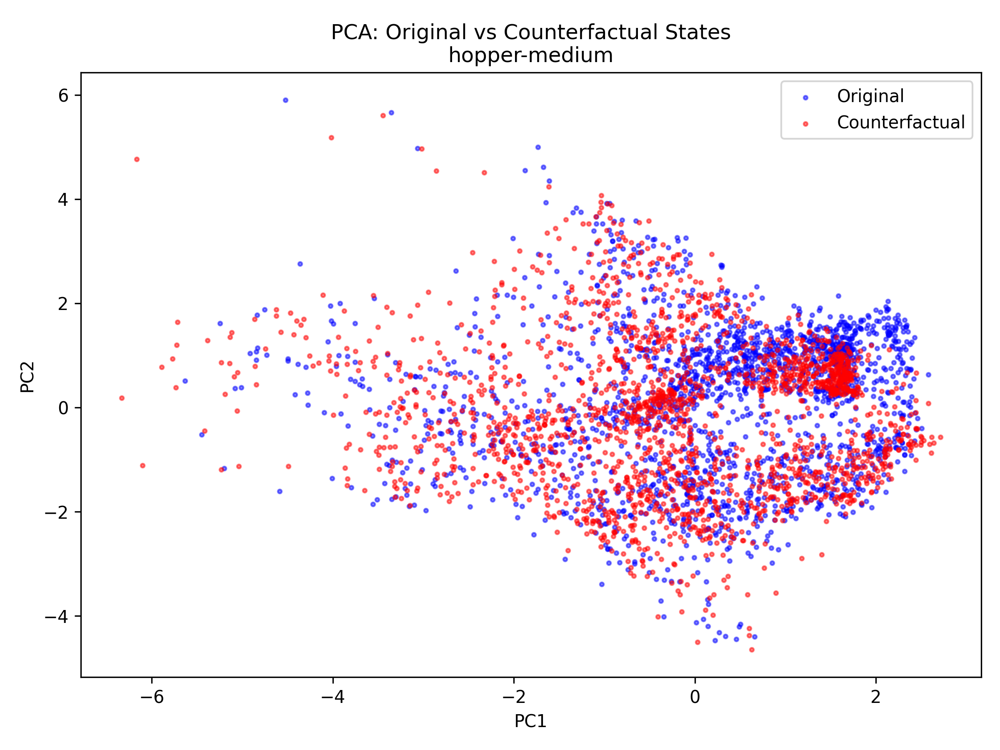
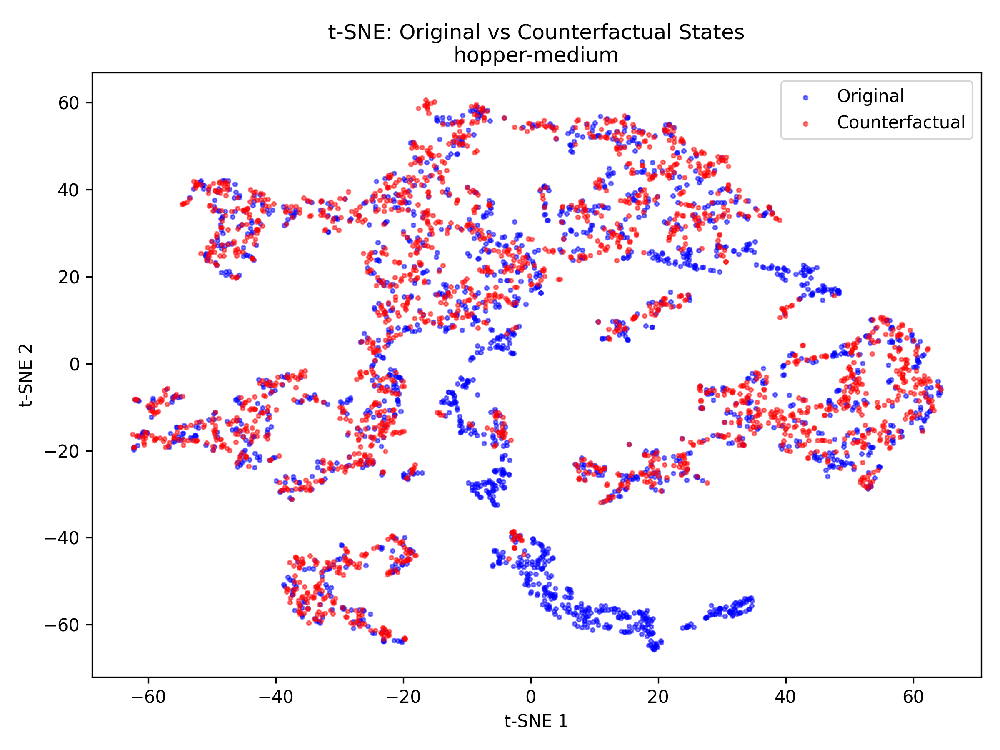

*Table R1.* Extended results on Table 1 with cross-paradigm baselines (ReBRAC†, EDAC†). Bold denotes the best score and any within 5% of the best. † denotes value-based actor-critic methods.

| Method | HC-m | HC-mr | HC-me | Hop-m | Hop-mr | Hop-me | Wk-m | Wk-mr | Wk-me | Ant-u | Ant-ud |
|--------|------|-------|-------|-------|--------|--------|------|-------|-------|-------|--------|
| IQL | 47.4 | 44.2 | 86.7 | 66.3 | **94.7** | 91.5 | 78.3 | 73.9 | **109.6** | 87.5 | 62.2 |
| CQL | 44.0 | 37.5 | 91.6 | 58.5 | **95.0** | 105.4 | 72.5 | 77.2 | **108.8** | 74.0 | **84.0** |
| DT | 42.6 | 36.6 | 86.8 | 67.6 | 82.7 | **107.6** | 74.0 | 66.6 | **108.1** | 69.8 | 70.3 |
| DC | 43.0 | 41.3 | 93.0 | 92.6 | **94.2** | **110.4** | 79.2 | 76.6 | **109.6** | 82.2 | 78.5 |
| LSDT | 43.6 | 42.9 | 93.2 | 87.2 | **93.9** | **111.7** | 81.0 | 74.7 | **109.8** | 80.0 | **83.2** |
| CSET | 44.9 | 43.5 | 93.1 | 93.4 | **94.8** | **112.0** | 82.5 | 77.0 | **110.7** | 83.1 | **84.5** |
| ReBRAC† | **63.0** | 47.1 | **100.5** | **98.4** | **91.3** | 105.2 | 82.1 | **81.4** | **108.9** | **94.1** | **80.5** |
| EDAC† | **64.2** | **58.3** | **100.8** | **96.2** | **92.5** | 100.1 | **89.4** | **83.0** | **109.2** | 0.0 | 0.0 |

---

*Figure R1.* Extended results on Figure 3 (Section 4.4) with ReBRAC and EDAC.

<table><tr>
<td></td>
<td></td>
<td></td>
</tr></table>

---

*Table R2.* Training time and parameter comparison (Hopper-medium).

| Method | Augmentation | Policy Training | Total | Policy Params |
|--------|-------------|----------------|-------|--------------|
| DC | — | 74 min | 74 min | 268K |
| CSET | 8 min (CRM+CSG) | 63 min | 71 min | 331K |
| ReBRAC | — | 98 min | 98 min | 216K |
| EDAC | — | 19 hours | 19 hours | 794K |

---

*Figure R2.* PCA (left) and t-SNE (right) of original (blue) vs counterfactual (red) states for HalfCheetah-medium. 

<table><tr>
<td></td>
<td></td>
</tr></table>

---

*Figure R3.* PCA (left) and t-SNE (right) of original (blue) vs counterfactual (red) states for Hopper-medium.

<table><tr>
<td></td>
<td></td>
</tr></table>
